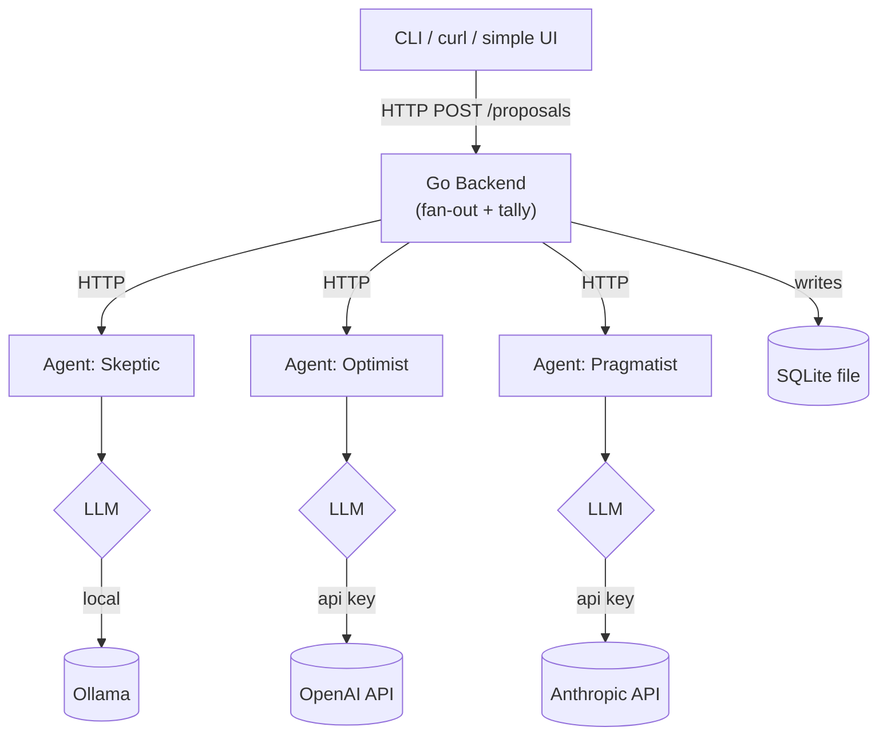

# AI Committee — Architecture (Side-Project Edition)

A small multi-personality AI decision system: a Go backend sends a question to a handful
of Python "personality" agents, each answers using its own LLM (local or API), and the
Go side tallies the votes into a decision. Built to be cloneable, runnable with one
`docker compose up`, and easy to read end-to-end — not a production platform.

---

## 1. Core Concepts

| Term | Meaning |
|---|---|
| **Personality (Agent)** | A Python microservice with a system prompt + its own LLM backend (local or API). |
| **Proposal** | The question submitted to the committee. |
| **Vote** | A personality's structured answer: stance, confidence, reasoning. |
| **Voting Strategy** | How votes become a decision (majority or weighted, to start). |
| **Decision** | The tallied outcome, returned with everyone's reasoning attached. |

Kept out of v1 on purpose: multi-round deliberation, a "chair" veto role, quorum rules.
These are natural stretch goals (see §9) once the core loop works.

---

## 2. Architecture



Plain REST/JSON between the Go backend and the Python agents — no protobuf toolchain to
maintain for a project this size. gRPC is a reasonable upgrade later if you want to
showcase it, but it's overhead you don't need to get this working.

Storage is a single SQLite file (via `mattn/go-sqlite3` or `modernc.org/sqlite`), not a
separate DB container — one less moving part to run and explain in a README.

---

## 3. Repository Structure

```
ai-committee/
├── backend/                     # Go
│   ├── cmd/server/main.go
│   ├── internal/
│   │   ├── api/                 # HTTP handlers
│   │   ├── orchestrator/        # fan-out to agents
│   │   ├── voting/              # strategy interfaces + majority/weighted
│   │   ├── agentclient/         # HTTP client to the Python agents
│   │   ├── config/               # yaml loader
│   │   └── storage/             # sqlite repository
│   ├── go.mod
│   └── Dockerfile
├── agents/                      # Python — one image, many personalities
│   ├── app/
│   │   ├── main.py              # FastAPI app
│   │   ├── personality.py       # loads PERSONALITY_CONFIG yaml
│   │   └── llm_backends/
│   │       ├── base.py
│   │       ├── local_backend.py   # Ollama / any OpenAI-compatible server
│   │       ├── openai_backend.py
│   │       └── anthropic_backend.py
│   ├── requirements.txt
│   └── Dockerfile
├── configs/
│   ├── committee.yaml
│   └── personalities/
│       ├── skeptic.yaml
│       ├── optimist.yaml
│       └── pragmatist.yaml
├── docker-compose.yml
└── README.md
```

No `proto/`, no `deploy/k8s/`, no separate `pkg/models` — everything domain-specific lives
next to what uses it.

---

## 4. Agent API (REST/JSON)

Each agent exposes one endpoint. Simple enough to `curl` while debugging.

```
POST /deliberate
{
  "proposal_id": "abc123",
  "prompt": "Should we rewrite the auth service in Rust?"
}

→ 200 OK
{
  "personality_id": "skeptic",
  "stance": "reject",       // "approve" | "reject" | "abstain"
  "confidence": 0.7,
  "reasoning": "..."
}
```

```
GET /health → { "ready": true, "backend": "local" }
```

---

## 5. Go Backend

### 5.1 Voting interface

```go
// internal/voting/strategy.go
package voting

type Vote struct {
    PersonalityID string
    Stance        string  // "approve" | "reject" | "abstain"
    Confidence    float64
    Weight        float64
    Reasoning     string
}

type Decision struct {
    Outcome string
    Tally   map[string]float64
}

type Strategy interface {
    Name() string
    Tally(votes []Vote) Decision
}
```

Start with two implementations: `MajorityStrategy` (count stances) and
`WeightedStrategy` (multiply by each personality's configured `weight` before counting).

### 5.2 Orchestration

```go
func (o *Orchestrator) RunProposal(ctx context.Context, p Proposal) (Decision, error) {
    votes, err := o.fanOutDeliberate(ctx, p) // parallel HTTP calls, errgroup
    if err != nil {
        return Decision{}, err
    }
    decision := o.strategy.Tally(votes)
    o.storage.Save(p, votes, decision)
    return decision, nil
}
```

`fanOutDeliberate` calls every agent concurrently with `golang.org/x/sync/errgroup` and a
per-call timeout; a timed-out agent counts as `abstain` rather than failing the round.

### 5.3 API surface

- `POST /api/proposals` — submit a question, get back the decision (synchronous is fine at this scale)
- `GET /api/proposals/{id}` — look up a past decision + each agent's reasoning

### 5.4 Go dependencies

| Package | Purpose |
|---|---|
| `github.com/go-chi/chi/v5` | HTTP router |
| `gopkg.in/yaml.v3` | Config parsing |
| `golang.org/x/sync/errgroup` | Parallel fan-out |
| `modernc.org/sqlite` (or `mattn/go-sqlite3`) | Storage, no external DB needed |
| `github.com/google/uuid` | ID generation |
| `github.com/stretchr/testify` | Testing |

That's it — no viper, no zap, no grpc, no redis. `log/slog` (stdlib) is fine for logging.

---

## 6. Python Agents

Same "one image, config picks the personality" pattern as before — it's the part of the
design worth keeping regardless of scale, since it's what makes personalities pluggable.

```python
# app/llm_backends/base.py
from abc import ABC, abstractmethod

class LLMBackend(ABC):
    @abstractmethod
    async def generate(self, system_prompt: str, user_prompt: str) -> str:
        ...
```

```python
# app/llm_backends/local_backend.py
import httpx
from .base import LLMBackend

class LocalBackend(LLMBackend):
    """Any OpenAI-compatible local server: Ollama, LM Studio, vLLM."""
    def __init__(self, endpoint: str, model_name: str):
        self.model_name = model_name
        self.client = httpx.AsyncClient(base_url=endpoint)

    async def generate(self, system_prompt, user_prompt) -> str:
        resp = await self.client.post("/chat/completions", json={
            "model": self.model_name,
            "messages": [
                {"role": "system", "content": system_prompt},
                {"role": "user", "content": user_prompt},
            ],
        })
        resp.raise_for_status()
        return resp.json()["choices"][0]["message"]["content"]
```

`OpenAIBackend` and `AnthropicBackend` are the same shape, just pointed at the real APIs
with an `api_key` pulled from an env var. A tiny `factory.py` picks one based on
`config["provider"]`.

### 6.1 Python dependencies

| Package | Purpose |
|---|---|
| `fastapi`, `uvicorn` | HTTP server |
| `pydantic` | Request/response validation |
| `httpx` | Calls to local or API LLM endpoints |
| `openai` | OpenAI SDK |
| `anthropic` | Claude SDK |
| `pyyaml` | Personality config parsing |

---

## 7. Configuration

### 7.1 Personality (`configs/personalities/skeptic.yaml`)

```yaml
id: skeptic
name: "The Skeptic"
system_prompt: |
  You are a skeptical committee member. Question assumptions and
  surface risks before agreeing to anything.
model:
  provider: local              # local | openai | anthropic
  model_name: "llama3:8b"
  endpoint: "http://ollama:11434/v1"
  api_key_env: ""
voting:
  weight: 1.0
```

An API-backed personality just swaps the `model` block:

```yaml
model:
  provider: openai
  model_name: "gpt-4.1"
  api_key_env: "OPENAI_API_KEY"
```

### 7.2 Committee (`configs/committee.yaml`)

```yaml
committee:
  members: [skeptic, optimist, pragmatist]
  voting:
    strategy: majority   # or "weighted"
  timeout_seconds: 30
```

Secrets (`OPENAI_API_KEY`, `ANTHROPIC_API_KEY`) go in a git-ignored `.env`, referenced by
name only in the yaml.

---

## 8. `docker-compose.yml`

```yaml
version: "3.9"
services:
  backend:
    build: ./backend
    ports: ["8080:8080"]
    environment:
      - CONFIG_PATH=/configs/committee.yaml
    volumes:
      - ./configs:/configs:ro
      - ./data:/data          # sqlite file lives here
    depends_on: [agent-skeptic, agent-optimist, agent-pragmatist]

  agent-skeptic:
    build: ./agents
    environment:
      - PERSONALITY_CONFIG=/configs/personalities/skeptic.yaml
    volumes: ["./configs:/configs:ro"]

  agent-optimist:
    build: ./agents
    environment:
      - PERSONALITY_CONFIG=/configs/personalities/optimist.yaml
      - OPENAI_API_KEY=${OPENAI_API_KEY}
    volumes: ["./configs:/configs:ro"]

  agent-pragmatist:
    build: ./agents
    environment:
      - PERSONALITY_CONFIG=/configs/personalities/pragmatist.yaml
      - ANTHROPIC_API_KEY=${ANTHROPIC_API_KEY}
    volumes: ["./configs:/configs:ro"]

  ollama:
    image: ollama/ollama
    ports: ["11434:11434"]
    volumes: ["ollama_data:/root/.ollama"]

volumes:
  ollama_data:
```

Six services, no external DB, `docker compose up` and you have a working committee.

---

## 9. Build Order

1. One agent, one personality, `provider: openai` only — prove the FastAPI `/deliberate` endpoint works.
2. Go backend that calls that one agent and returns its raw vote — prove the fan-out plumbing.
3. Add two more personalities + `MajorityStrategy` — this is the "it's actually a committee now" milestone.
4. Add the `LocalBackend` + Ollama service — swap one personality to local and confirm nothing else changes.
5. Add SQLite persistence + `GET /api/proposals/{id}` — decisions survive a restart.
6. Write the README with a `docker compose up` + `curl` example — this is what makes it a good portfolio piece.

### Later, if you want to extend it
- Multi-round deliberation (agents see each other's reasoning and re-vote)
- A "chair" personality with tie-break power
- `weighted` / `consensus_threshold` strategies
- Swap REST for gRPC between backend and agents
- Swap SQLite for Postgres if you need concurrent writers
- A minimal web UI instead of curl
